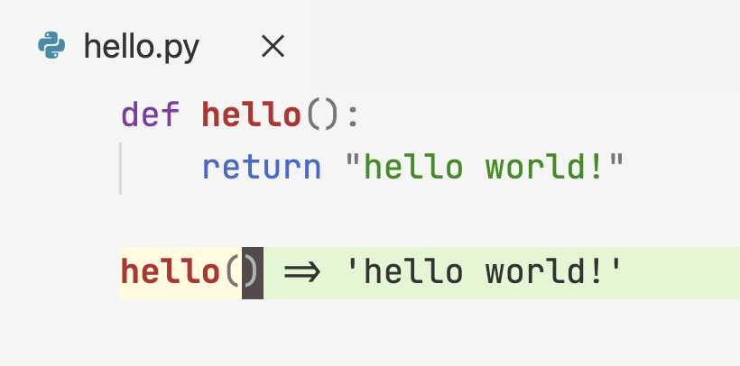

# Peptide: Interactive, REPL-driven programming for Python


This extension is still in early development.

---




Peptide provides key-bindings to interactively develop Python programs, like
CIDER/SLIME in the Lisp world.

Peptide is syntax-aware. It uses `tree-sitter` to parse the source file and
select the appropriate code to execute in the REPL. See the [Features](#features)
section for what can be selected.

Instead of printing the evaluation result to the terminal, Peptide
displays the result inline, in the text editor. This provides instantaneous
feedback and greater interactivity to the development experience.

## Quick Start

Peptide uses Jupyter as a REPL backend. 

> NOTE: if you don't have Jupyter, follow the 
[instructions](https://jupyter.org/install) to install it.

1. In your Python project's root folder, start a Jupyter server:

    ```bash
    $ jupyter server

    [I 2022-01-15 15:55:44.742 ServerApp] Jupyter Server 1.13.1 is running at:
    [I 2022-01-15 15:55:44.742 ServerApp] http://localhost:8888/?token=baf72577cfb778a52d0317347c7863359a3facc17464f710
    ```

2. Copy the URL in the output. This contains the token that Peptide uses
to communicate with the Jupyter Server.

3. In VSCode, go to "View" -> "Command Palette" (or 
<kbd>Cmd</kbd> + <kbd>Shift</kbd> + <kbd>P</kbd> on Mac).
Run `Peptide: Connect to a Running Jupyter Server`,
and paste the URL.

4. Use any of the code evaluation commands described in the 
[feature](#feature) section.

5. At any time, press 
<kbd>Shift</kbd> + <kbd>Esc</kbd>, 
or choose `Peptide: Clear Inline Evaluation Result` in the
Command Palette to clear the inline evaluation results.

## Features

### Evaluate current top-level statement

* key-binding: <kbd>Alt/Option</kbd> + <kbd>Enter</kbd>

This command selects the top-level statement (e.g. function
definition, assign statement, function call, etc.) under 
cursor, and evaluates it.

### Evaluate preceding form

* key-binding: <kbd>Ctrl</kbd> + <kbd>Enter</kbd>

A form is one of:

* parenthesized_expression
* function call
* identifier (variable),
* or, a primitive value

This command selects a form that's immediately before the cursor.
This is useful when inspecting parameters passed into a function
call.

### Evaluate the entire script

* key-binding: <kbd>Ctrl</kbd> + <kbd>Alt</kbd>+ <kbd>Enter</kbd>

This command sends the entire source file to the REPL
for evaluation. This is useful when loading up the functions
in the file before calling the evaluation commands.

<!-- ## Known Issues -->

<!-- TODO -->


## Release Notes

This extension is still in early development.

## Why the name?

Peptide is the **P**ython **E**ditor **P**lugin **T**o **I**nteractively **D**evelop and **E**valuate, à la CIDER and SLIME.